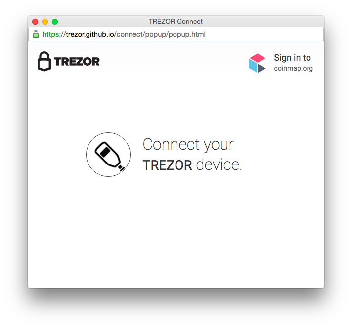
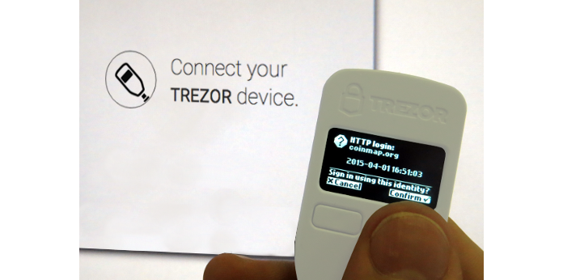

# TREZOR Connect API

TREZOR Connect is a platform for easy integration of TREZOR into 3rd party
services. It provides websites with functionality to authenticate users, access
public keys and sign transactions. User interface is presented in a secure popup
window:



User needs to confirm actions on his TREZOR:



More general (and slightly obsolete) info can be found [here](https://doc.satoshilabs.com/trezor-tech/api-connect.html).

Examples of usage can be found on https://trezor.github.io/connect/examples/ 

## Usage

First, you need to include the library in your page:

```html
<script src="https://trezor.github.io/connect/connect.js"></script>
```

Bower package `trezor-connect` is also available.

All API calls have a callback argument.  Callback is guaranteed to get called
with a result object, even if user closes the window, network connection times
out, etc.  In case of failure, `result.success` is false and `result.error` is
the error message.  It is recommended to log the error message and let user
restart the action.

1. [Login](#login)
2. [Export public key](#export-public-key)
3. [Sign transaction](#sign-transaction)
4. [Request payment](#request-payment)

## Login

Challenge-response authentication via TREZOR. To protect against replay attacks,
you must use a server-side generated and randomized `challenge_hidden` for every
attempt.  You can also provide a visual challenge that will be shown on the
device.

Service backend needs to check whether the signature matches the generated
`challenge_hidden`, provided `challenge_visual` and stored `public_key` fields.
If that is the case, the backend either creates an account (if the `public_key`
identity is seen for the first time) or signs in the user (if the `public_key`
identity is already a known user).

To understand the full mechanics, please consult the Challenge-Response chapter
of
[SLIP-0013: Authentication using deterministic hierarchy](https://github.com/satoshilabs/slips/blob/master/slip-0013.md).

### Using Javascript API

[Example:](examples/login-js.html)

```javascript
// site icon, optional. at least 48x48px
var hosticon = 'https://example.com/icon.png';

// server-side generated and randomized challenges
var challenge_hidden = '';
var challenge_visual = '';

TrezorConnect.requestLogin(hosticon, challenge_hidden, challenge_visual, function (result) {
	if (result.success) {
		console.log('Public key:', result.public_key); // pubkey in hex
		console.log('Signature:', result.signature); // signature in hex
        console.log('Version 2:', result.version === 2); // version field
	} else {
		console.error('Error:', result.error);
	}
});
```

### Using HTML button

All `<trezor:login>` tags get transformed into HTML login buttons. The
parameters are exactly the same as for
[`TrezorConnect.requestLogin`](#using-javascript-api), but `callback` represents
name of global function that gets called with the result.

[Example:](examples/login.html)

```html
<script>
function trezorLoginCallback(result) {
    if (result.success) {
        console.log('Public key:', result.public_key); // pubkey in hex
        console.log('Signature:', result.signature); // signature in hex
        console.log('Version 2:', result.version === 2); // version field
    } else {
        console.error('Error:', result.error);
    }
}
</script>

<!-- callback is a name of global function -->
<!-- challenges are server-side generated and randomized -->
<!-- site icon is optional and at least 48x48px -->
<!-- text is optional -->
<trezor:login callback="trezorLoginCallback"
              challenge_hidden="0123456789abcdef"
              challenge_visual="Lorem Ipsum"
              text="Sign in with TREZOR"
              icon="https://example.com/icon.png"></trezor:login>
```

`<trezor:login>` tags are rendered after loading the TREZOR Connect script. In
case you need to render dynamically created content, call
`TrezorConnect.renderLoginButtons()`.

You can restyle the login button to fit the look of your website.  See the
example in [`examples/login-restyled.html`](examples/login-restyled.html).  The
default CSS being used is [`login_buttons.css`](login_buttons.css):


### Server side

Here is the reference implementation of the server-side signature verification
written in various languages:

- **Python**: [`examples/server.py`](examples/server.py)
- **PHP**: [`examples/server.php`](examples/server.php)
- **Ruby**: [`examples/server.rb`](examples/server.rb)
- **C#**: [`examples/server.cs`](examples/server.cs)

## Export public key

`TrezorConnect.getXPubKey(path, callback)` retrieves BIP32 extended public key
by path.  User is presented with a description of the requested key and asked to
confirm the export.

[Example:](examples/xpubkey.html)

```javascript
var path = "m/44'/0'/0'"; // first BIP44 account

// var path = [44 | 0x80000000,
//             0  | 0x80000000,
//             0  | 0x80000000]; // same, in raw form

TrezorConnect.getXPubKey(path, function (result) {
    if (result.success) {
        console.log('XPUB:', result.xpubkey); // serialized XPUB
    } else {
        console.error('Error:', result.error); // error message
    }
});
```

If you omit the path, BIP-0044 account discovery is performed and user is
presented with a list of discovered accounts.  Node of selected account is then
exported.  [Example.](examples/xpubkey-discovery.html)

## Sign transaction

`TrezorConnect.signTx(inputs, outputs, callback)` asks device to sign given
inputs and outputs of pre-composed transaction.  User is asked to confirm all tx
details on TREZOR.

- `inputs`: array of [`TxInputType`](https://github.com/trezor/trezor-common/blob/master/protob/types.proto#L145-L158)
- `outputs`: array of [`TxOutputType`](https://github.com/trezor/trezor-common/blob/master/protob/types.proto#L160-L172)


[PAYTOADDRESS example:](examples/signtx-paytoaddress.html)

```javascript
// spend one change output
var inputs = [{
    address_n: [44 | 0x80000000, 0 | 0x80000000, 2 | 0x80000000, 1, 0],
    prev_index: 0,
    prev_hash: 'b035d89d4543ce5713c553d69431698116a822c57c03ddacf3f04b763d1999ac'
}];

// send to 1 address output and one change output
var outputs = [{
    address_n: [44 | 0x80000000, 0 | 0x80000000, 2 | 0x80000000, 1, 1],
    amount: 3181747,
    script_type: 'PAYTOADDRESS'
}, {
    address: '18WL2iZKmpDYWk1oFavJapdLALxwSjcSk2',
    amount: 200000,
    script_type: 'PAYTOADDRESS'
}];

TrezorConnect.signTx(inputs, outputs, function (result) {
    if (result.success) {
        console.log('Transaction:', result.serialized_tx); // tx in hex
        console.log('Signatures:', result.signatures); // array of signatures, in hex
    } else {
        console.error('Error:', result.error); // error message
    }
});
```

[PAYTOMULTISIG example.](examples/signtx-paytomultisig.html)

## Request payment

`TrezorConnect.composeAndSignTx(recipients, callback)` requests a payment from
the user's wallet to a set of given recipients.  Internally, a BIP-0044 account
discovery is performed, user is presented with a list of accounts.  After
selecting an account, transaction is composed by internal coin-selection
preferences.  Transaction is then signed and returned in the same format as
`signTx`.  Change output is added automatically, if needed.

[Example:](examples/composetx.html)

```javascript
var recipients = [{
    address: '18WL2iZKmpDYWk1oFavJapdLALxwSjcSk2',
    amount: 200000
}];

TrezorConnect.composeAndSignTx(recipients, function (result) {
    if (result.success) {
        console.log('Serialized TX:', result.serialized_tx); // tx in hex
        console.log('Signatures:', result.signatures); // array of signatures, in hex
    } else {
        console.error('Error:', result.error); // error message
    }
});

```

You can also push the transaction to the network with a call.

[Example:](examples/composetx-push.html)
```javascript
TrezorConnect.composeAndSignTx(outputs, function (result) {
    if (result.success) {
        TrezorConnect.pushTransaction(result.serialized_tx, function (pushResult) {
            if (pushResult.success) {
                console.log('Transaction pushed. Id:', pushResult.txid); // ID of the transaction
            } else {
                console.error('Error:', pushResult.error); // error message
            }
        });
    } else {
        console.error('Error:', result.error); // error message
    }
});

```

## Sign a message

`TrezorConnect.signMessage(path, message, callback [,coin])` asks device to
sign a message using the private key derived by given BIP32 path. Path can be specified 
either as an array of numbers or as string m/A'/B'/C/...

Message is signed and address + signature is returned

[Example:](examples/signmsg.html)

```javascript
var path="m/44'/0'/0";
var message='Example message';

TrezorConnect.signMessage(path, message, function (result) {
    if (result.success) {
        console.log('Message signed!', result.signature); // signature in base64
        console.log('Signing address:', result.address); // address in standard b58c form
    } else {
        console.error('Error:', result.error); // error message
    }
});
```

**note:** The argument coin is optional and defaults to "Bitcoin" if missing.

The message can be UTF-8; however, TREZOR is not displaying non-ascii characters, and third-party apps are not dealing with them correctly either. Therefore, using ASCII only is recommended.

## Symmetric key-value encryption

`TrezorConnect.signMessage(path, key, value, encrypt, ask_on_encrypt, ask_on_decrypt, callback)` asks device to
encrypt value
using the private key derived by given BIP32 path and the given key. Path can be specified 
either as an array of numbers or as string m/A'/B'/C/... , value must be hexadecimal value - with length a multiple of 16 bytes (so 32 letters in hexadecimal).

More information can be found in [SLIP-0011](https://github.com/satoshilabs/slips/blob/master/slip-0011.md). IV is always computed automatically.

[Example](examples/signmsg.html):

```javascript
var path = "m/44'/0'/0";
var message = '1c0ffeec0ffeec0ffeec0ffeec0ffee1';
var key = 'This is displayed on TREZOR on encrypt.';
var encrypt = true;
var ask_on_encrypt = true;
var ask_on_decrypt = false;

TrezorConnect.cipherKeyValue(path, key, value, encrypt, ask_on_encrypt, ask_on_decrypt, function (result) {
    if (result.success) {
        console.log('Encrypted!', result.value); // in hexadecimal
    } else {
        console.error('Error:', result.error); // error message
    }
});
```

## Get first unused address

`TrezorConnect.getFreshAddress(callback)` gets first unused address of an account.

The user is offered a selection of accounts and has to select one.

[Example:](examples/freshaddress.html)

```javascript
TrezorConnect.getFreshAddress(function (result) {
   if (result.success) {
       resultEl.innerHTML = result.address; // fresh address
   } else {
       console.error('Error:', result.error); // error message
   }
});
```

## Get balance

`TrezorConnect.getBalance(callback)` returns balance of an account, plus "confirmed" balance (transactions with at least 1 confirmation).

The user is offered a selection of accounts and has to select one.

[Example:](examples/balance.html)

```javascript
TrezorConnect.getBalance(function (result) {
    if (result.success) {
        console.log('Balance including unconfirmed (in satoshis):', result.balance);
        console.log('Confirmed balance (in satoshis):', result.confirmed);
    } else {
        console.error('Error:', result.error); // error message
    }
});
```

